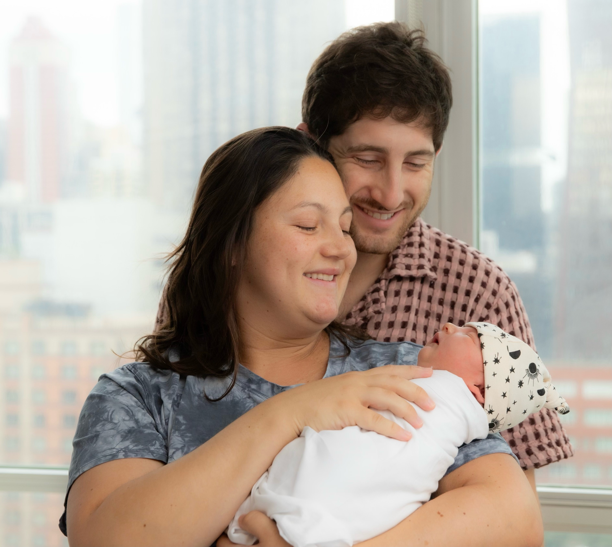
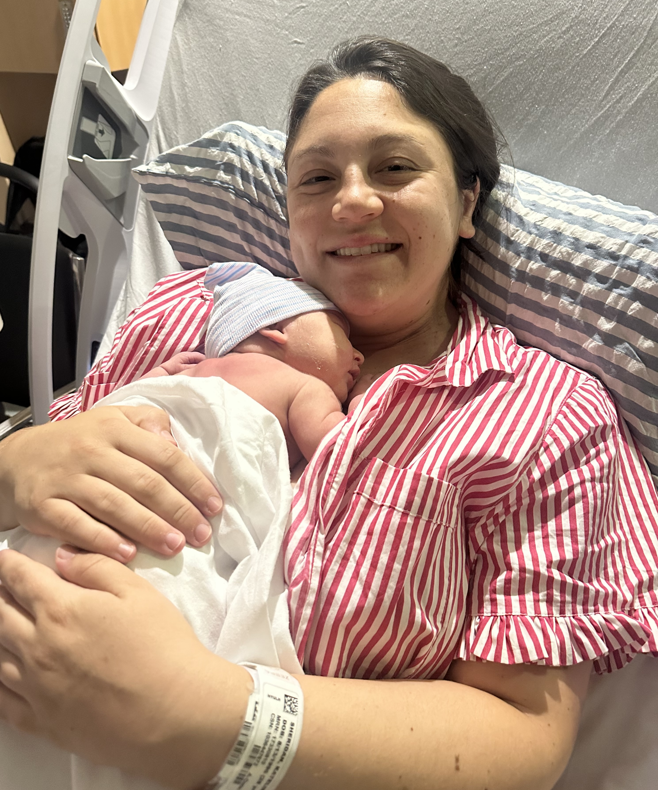
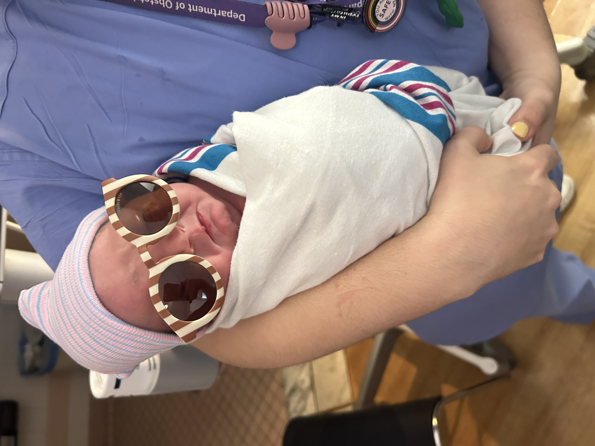
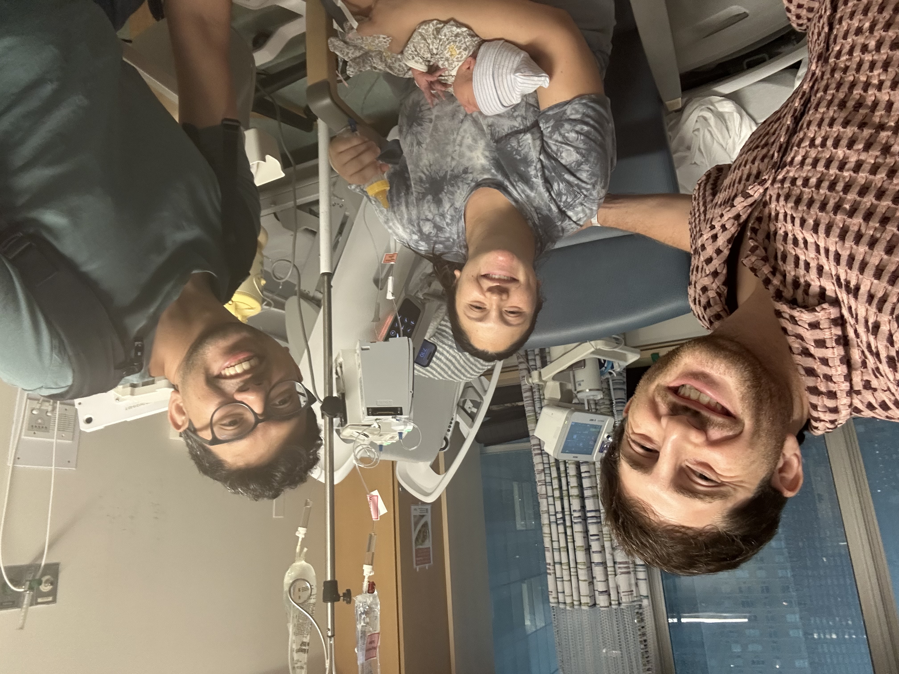
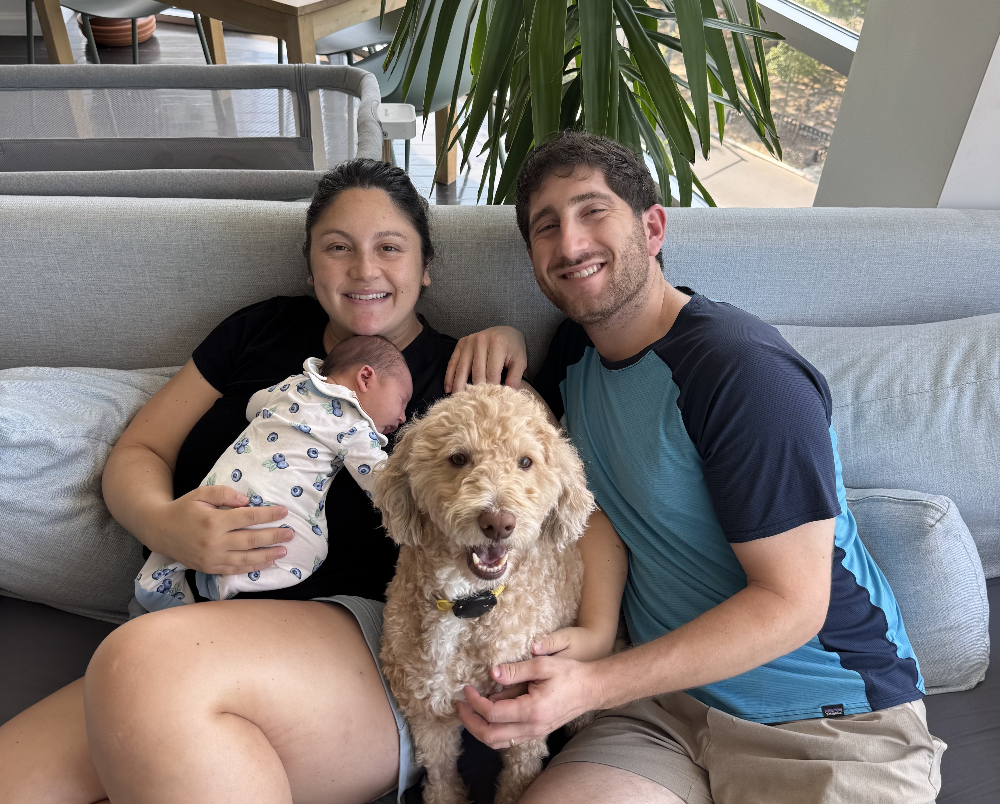
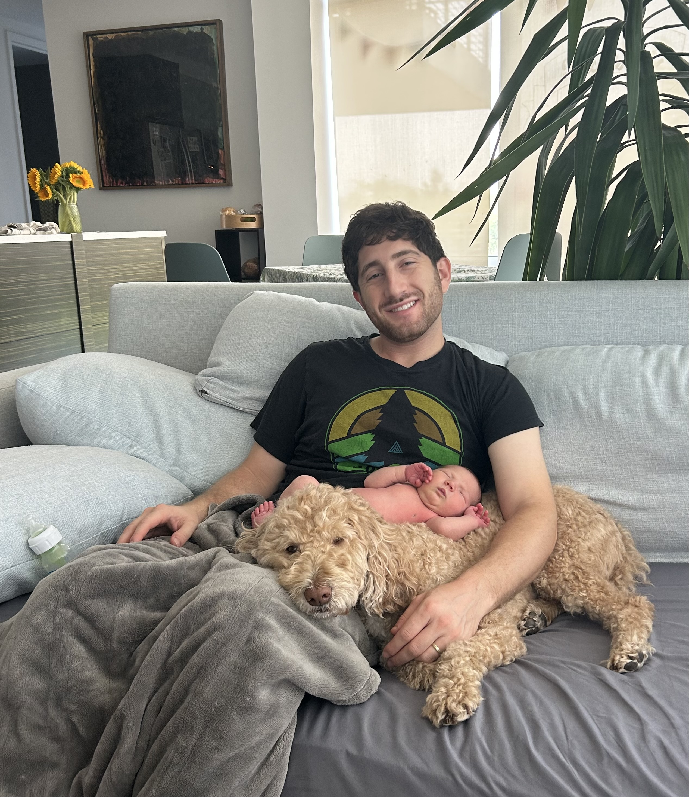

Welcome to the world, **Mia Kavich Sheridan**! We think Mia is a beautiful name and Kavich is a family maiden name.

Mia was born the morning of August 12, 2025 and weighed in at 8 pounds. She is an early birthday gift for Mom whose birthday is the next day. We already have a rule that they won't share birthday celebrations—they deserve their own days.

## This is awesome

- We're doing some styling

```python
print('hello world')
```

<Callout intent="check" title="Do this thing">
  Do this check

</Callout>

## Baby Photos

<Frame >
  
  </Frame>

<Frame>

</Frame>

<Frame>

</Frame>

<Frame caption="Our first family photo ❤️">
  
</Frame>

<Frame caption="Cuddle time">
  
</Frame>

<Frame caption="Cool girl in the delivery room!">
  
</Frame>

<Frame caption="The co-founder relationship runs _Deep_">
  
</Frame>

<Frame caption="Cozy swaddle">
  
</Frame>

<Frame caption="Welcome home art by @hannah_sheridan! 🏠">
  
</Frame>

<Frame caption="All four of us together 🐶">
  
</Frame>

<Frame caption="Mia and Markley">
  
</Frame>

<Frame caption="Tiny fingers! 👶">
  
</Frame>

## Appreciation

Shout out to the nurses, doctors, lactation consultants, meal service, and even cleaning staff at the hospital for their care and support. We're blessed to have such a wonderful team of professionals at NYU Langone to help us in this journey.

## Visitors

For local visitors, please reach out to Danny to coordinate time to pop by. We are excited to spend time with family and friends and invite you to join us!

Given baby's developing immune system, we are asking that you please reschedule your visit if you are sick.

Thank you for being part of our journey into parenthood! 💕
