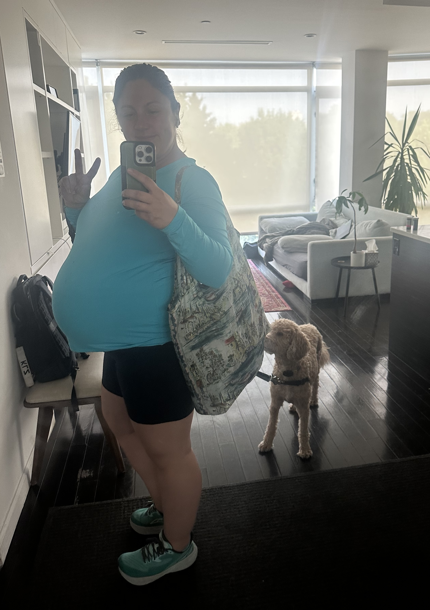

Baby Sheridan is the size of a watermelon. We've got the nursery geared up and hospital bags packed.

<Frame caption="Growing that baby bump! 🤰">
  
</Frame>

## Visitors

For local visitors, please reach out to Danny to coordinate time to pop by. We are excited to spend time with family and friends and invite you to join us!

Given baby's developing immune system, we are asking that you please reschedule your visit if you are sick.

## Meal Train

Want to help us out with a meal? We'd love your support! 🍽️

After the baby arrives, we'll be adjusting to life as new parents and would appreciate having to plan one less meal. If you'd like to participate, **[sign up for our meal train](https://mealtrain.com/532z5r)**.

## Gifts

We are fortunate to have a thorough collection of hand-me-downs from siblings and friends. We have plenty of books, clothes, toys, blankets, and everything else to provide comfort to our baby. We are intentional about the number of physical items we keep in our home and would appreciate your support in other ways. 

Instead of physical gifts, how about:

1. Coming out to NY to spend time with us, let's go for a walk, chat, and break bread together. [preferred]
2. Writing a letter. Share about yourself, a piece of advice, and include a photo or two. We'll put your letter in a baby book we're curating.
3. Contributing to Baby Sheridan's 529 plan for college. (Planning 18 years ahead!) Danny can provide more details.

<Frame caption="Look closely - the baby's waving hello! 👋">
  
</Frame>