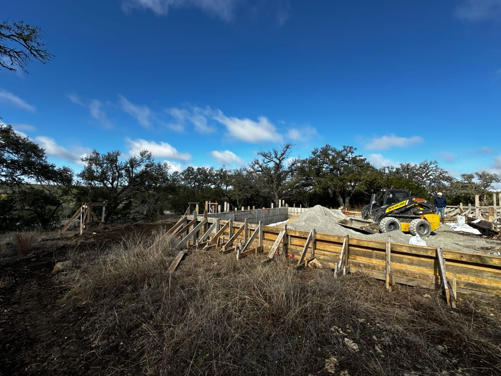

We broke ground on our new house outside of Austin in February 2025.

  

    
    

      Wooden formwork set up in the shape of our house to create the concrete foundation.
    

  

  

    
    

      Foundation construction with fill that preceeds the concrete slab being poured.
    

  

  <Card>
    
Project Milestones

    

      

        ✓ Designs completed by architect (November 2024)
      

      

        ✓ Contract signed with builder (February 2025)
      

      

        ✓ Broke ground (February 2025)
      

      

        ○ Construction completed
      

      

        ○ Furnished and decorated
      

      

        ○ Project complete (🤞 April 2026)
      

    

  </Card>

