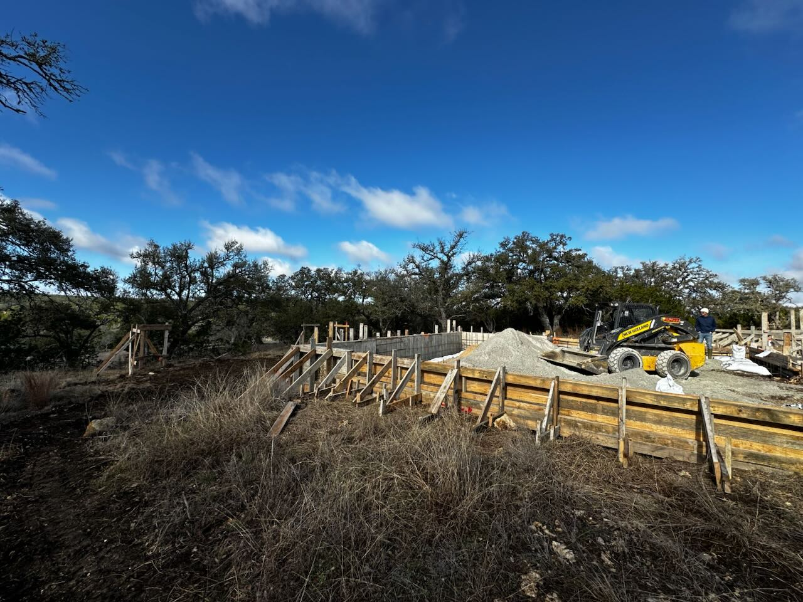

Construction is well underway! The cabinets have been installed, but not painted, and tile has been installed and grouted. Next up is painting the walls, cabinets, trim, and doors. They are working on the septic system and rain water collection system, both necessary since we are outside the range of public utilities (aside from electricity).

We’ve been shipping furniture and other house items to a warehouse in Austin and will be moving it into the house the first week of December.

## Photos from September 2025

<Frame caption="Ceiling in the living room">

</Frame>

<Frame caption="Kitchen cabinets installed but not painted">
  
</Frame>

## Photos from August 2025

<Frame caption="Garage construction completed">
  
</Frame>

<Frame caption="Siding installation completed">
  
</Frame>

<Frame caption="Drywall work in progress">
  
</Frame>

## Photos from July 2025

<Frame caption="Studs are in">
  
</Frame>

<Frame caption="Siding going up on the exterior">
  
</Frame>
Shout out to the workers who are making this happen while enduring the Texas summer heat.

## Photos from May 2025

<Frame caption="Framing work in progress">
  
</Frame>

<Frame caption="Site preparation and foundation work">
  
</Frame>

